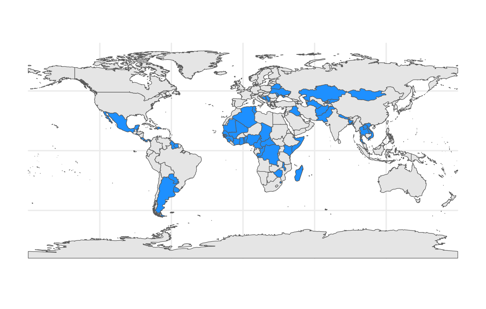
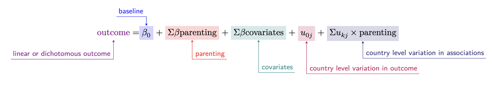
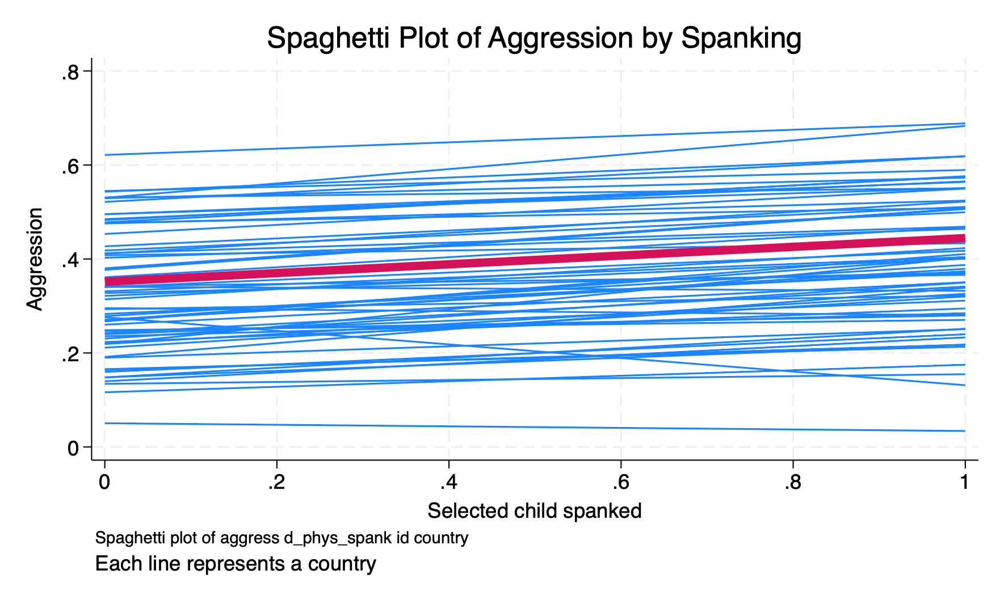
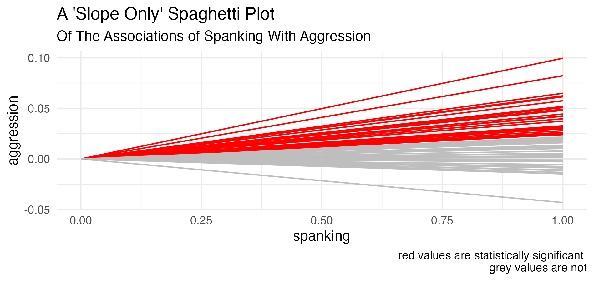

```{r}
#| output: false
#| echo: false

library(tibble) # data frames

library(ggplot2) # beautiful graphs

library(geomtextpath) # path geoms

library(readr) # read csv

library(plotly) # interactive graphs

library(dplyr) # data wrangling

library(tidyr) # tidy data

library(countrycode) # work with country names

library(sf) # simple features

library(rnaturalearth) # natural earth data

```

::: {.content-visible when-format="revealjs"}
# How To Navigate This Presentation {transition="convex" transition-speed="slow"}

- Use the :arrow_left: :arrow_right: keys to move through the presentation.
- Press *o* for *panel overview*.
- Press **☰** for *menu*.
:::

# Acknowledgements

* Collaborators: 
  + Professor Julie Ma
  + Professor Yoonsun Han
  + Dr. Kaitlin Ward
* Members of the *Global Families Project*
* IPUMS
* NICHD

# The Scope of the Issue {.smaller}

::: {.incremental}
* UNICEF considers children globally to be in crisis: political violence, climate change, and poverty affect many children,
* In this time of crisis, parenting is one crucial area of focus.
* According to UNICEF data, $\frac{1}{3}$ of children are subject to physical punishment; $\frac{2}{3}$ to some form of violent punishment.
* In a review of 50 years of literature on physical punishment, @Gershoff2016 connect physical punishment to poor mental health outcomes, and other poor outcomes over the life course. @Ward2023 examines the relationship of multiple forms of parental discipline to child outcomes.
:::

# Are We Similar? Are We Different?

::: {layout-ncol=2}



:::

# Both Universals and Variation Are Important {.smaller .scrollable}

> "Despite the incredible diversity existing among and within human cultures, there are many phenomena that occur regularly in all known societies. These commonalities, or universals, while deriving in part from human nature, may also have specific social, cultural, and systemic sources. We need to develop a working understanding of these universals so that we might advance legitimate, empirically based human science set on [creating knowledge that is politically relevant to fostering real solutions to the problems that complicate human co-existence]{.fragment .highlight-red} in the Age of the Anthropocene." [@Antweiler2016]


# Highlighting Commonalities May Promote Intergroup Attitudes And Solidarity {.smaller}

> "@Hanel2019 cite research suggesting that 'highlighting similarities between groups [improves interpersonal and intergroup attitudes]{.fragment .highlight-red}.' Others have argued that 'build[ing] bonds of commonality across our differences' might be an [impetus for social transformation]{.fragment .highlight-red} [@Hunt-Hendrix2024]."

# The Argument Of This Presentation

::: {.incremental}
* Families, parents and children experience an incredible [diversity of circumstances]{.fragment .highlight-red}.
* Parents engage in [parenting behaviors]{.fragment .highlight-red} with consequent diversity, though with some surprising similarities.
* The [associations]{.fragment .highlight-red} of parenting with child outcomes are surprisingly consistent.
:::

# Data {.smaller}

MICS data collected by UNICEF from Low and Middle Income Countries (LMIC) around the world. <mark>$N = XXXXXXXX \text{ families}; N_{countries} = 60$</mark>

```{r}
#| output: false
#| echo: false

library(Statamarkdown)

```

```{r}
#| echo: false
#| output: false

mapdata <- ne_countries(scale = "medium", # medium scale
                        returnclass = "sf") # as sf object

MICS <- read_sf("MICS-shapefile/MICS.shp")

ggplot() +
  geom_sf(data=mapdata) +
  geom_sf(data = MICS, fill = "dodgerblue") +
  theme_minimal() # +
  # labs(title = "Countries in UNICEF MICS Data")

ggsave("MICS.png")

```

```{r}
#| echo: false
#| warning: false

country <- c("Algeria",  "Argentina",  "Bangladesh",  "Barbados",  "Belarus",  "Belize",  "Benin",  "Bosnia and Herzegovina",  "Cameroon",  "Central African Republic",  "Chad",  "Democratic Republic of the Congo",  "Republic of the Congo",  "Costa Rica",  "Cote d'Ivoire",  "Dominican Republic",  "El Salvador",  "Eswatini",  "Ghana",  "Guinea",  "Guinea Bissau",  "Guyana",  "Iraq",  "Jamaica",  "Kazakhstan",  "Kenya",  "Kosovo",  "Kyrgyzstan",  "Laos", "Macedonia",  "Madagascar",  "Malawi",  "Mali",  "Mauritania",  "Mexico",  "Moldova",  "Mongolia",  "Montenegro",  "Nepal",  "Nigeria",  "Pakistan",  "Panama",  "Paraguay",  "Sao Tome and Principe",  "Senegal",  "Serbia",  "Sierra Leone",  "Somalia",  "St. Lucia",  "State of Palestine",  "Suriname",  "Thailand",  "The Gambia",  "Togo",  "Trinidad and Tobago",  "Tunisia",  "Turkmenistan",  "Ukraine",  "Uruguay",  "Vietnam",  "Zimbabwe")

MICScountries <- data.frame(country)

MICScountries$country_iso <- countrycode(MICScountries$country, 
                                 'country.name', 
                                 'iso3c')

```

```{r}
#| echo: false

g <- list(showframe = TRUE, 
          showcoastlines = TRUE, 
          showcountries = TRUE,
          showland = TRUE,
          countrycolor = toRGB("grey"),
          showocean = TRUE,
          oceancolor = "white",
          projection = list(type = 'robinson' #,
                            # rotation = list(lon = -25,
                            #                 lat = 0,
                            #                 roll = 0)
                            ),
          showland = TRUE,
          landcolor = toRGB("lightgrey"),
          bgcolor = "transparent")

t <- list(family = "sans serif", 
          size = 8, 
          color = toRGB("black"))

l <- list(color = toRGB("black"), 
          width = 0.5)

p0 <- MICScountries %>% 
  plot_geo() %>% 
  add_trace(z = 1,
    text = ~country, 
    colors = "dodgerblue",
    hoverinfo = 'text',
    locations = ~country_iso, 
    showscale = FALSE,
    marker = list(size=10, line = l)) %>%
  layout(geo = g,
         plot_bgcolor='transparent',
         paper_bgcolor='transparent') %>% 
  config(displayModeBar = FALSE)

```


::: {.content-visible when-format="html"}
```{r}
#| echo: false
#| fig-cap: "Countries in UNICEF MICS Data"

p0

```
:::

::: {.content-visible unless-format="html"}

:::


# Sources of Variation In The Study of Parenting And Child Outcomes

```{r}
#| label: fig-variationsources
#| fig-cap: "Sources of Variation In The Study of Parenting And Child Outcomes"
#| fig-height: 6
#| echo: false
#| warning: false

# CONSIDER USING ANNOTATE

tribble(
  ~beta0, ~beta1, ~u0, ~u1,
  5, 0, .5, .25) %>% 
  uncount(weights = 30) %>%
  mutate(country = factor(row_number())) %>%
  ungroup() %>%
  rowwise() %>%
  mutate(intercept = beta0 + rnorm(1, 0, u0),
         slope = beta1 + rnorm(1, 0, u1)) %>%
  ggplot() +
  geom_abline(aes(intercept = intercept, 
                  slope = slope),
              color = "grey") +
  geom_segment(aes(x = 0, 
                   xend = 0,
                   y = max(intercept),
                   yend = min(intercept)),
               alpha = .25,
               color = "red",
               size = 1,
               arrow = arrow(ends = "both",
                             length = unit(0.1, 
                                           "inches"))) +
  # annotate(geom = "point", 
  #          x = 0, 
  #          y = 5, 
  #          color = "#FDE725",
  #          alpha = .5,
  #          size = 25) +
  annotate("text", 
           x = 2.0, 
           y = 2.5, 
           label = "variation in outcome",
           color = "red") +
  annotate("segment", 
           x = 2, 
           xend = .1, 
           y = 3, 
           yend = 5,
           colour = "red", 
           linewidth = 1, 
           arrow = arrow()) +
  annotate("segment", 
           x = 0, 
           xend = 10, 
           y = 1, 
           yend = 1,
           colour = "red", 
           linewidth = 1, 
           arrow = arrow(ends = "both")) +
  annotate("text",
           x = 5,
           y = .5,
           label = "variation in parenting behavior",
           color = "red") +
  geom_labelabline(aes(intercept = 5, 
                       slope = max(slope), 
                       label = "variation in relationship of \nparenting behavior \nto child outcome"),
                   size = 3,
                   text_only = TRUE,
                   textcolor = "red",
                   linecolor = "red") +
  geom_labelabline(aes(intercept = 5, 
                       slope = min(slope), 
                       label = "variation in relationship of \nparenting behavior \nto child outcome"),
                   size = 3,
                   text_only = TRUE,
                   textcolor = "red",
                   linecolor = "red") +
  labs(title = "Sources of Variation",
       subtitle = "In The Study of Parenting And Child Outcomes",
       x = "parenting behavior",
       y = "child outcome") +
  xlim(0, 10) +
  ylim(0, 10) +
  scale_color_viridis_d() +
  theme_minimal() 

```

# The Equation


 
# Parenting Behaviors Vary *Somewhat* Across Countries

Verbal reasoning (78%) and shouting (64%) are the most common parental discipline behaviors toward young children.

# The *Maximal Model* Approach {.smaller}

* Hypothetically, one might imagine that there could be group level unobserved factors which affect many regression slopes--i.e. the relationship between multiple predictors (e.g. $x_1$, $x_2$, $x_3$, etc.) and outcome variable $y$. 
* Arguably, were one to ignore these unobserved factors in statistical estimation, they would show up either in an error term ($e_i$ or $u_0$), or in the regression coefficients ($\beta$). 
* The above could lead to statistical bias and a substantive mis-estimation of important effects. Thus, there is a conceptual argument for including as many random effects—i.e. random slopes—in a statistical model as possible [@Barr2013; @Frank2018].
* There is also a substantive reason: We might be interested in the *sizes* of *all* the random slopes!

# Relationship of Parenting And Child Outcomes {.smaller .scrollable}

```{r, child=c('./mytable.md')}
```

# The Relationship of Parenting And Child Outcomes Shows Little Variation Across Countries

## A Standard Spaghetti Plot



## A Modified Spaghetti Plot



# Quantifying Diversity and Commonality in the Relationship of Parenting To Child Outcomes

1. Regression slopes--when statistically significant--are all in the same direction, and of at least somewhat similar magnitude.
2. The actual values of the $\text{var}(u_{kj})$ or $\text{range}(u_{kj})$ are small.

# The Argument Of This Presentation Revisited

* Families, parents and children experience an incredible [diversity of circumstances]{.fragment .highlight-red}.
* Parents engage in [parenting behaviors]{.fragment .highlight-red} with consequent diversity, though with some surprising similarities.
* The [associations]{.fragment .highlight-red} of parenting with child outcomes are surprisingly consistent.

# Implications {.smaller}

> "My conception of the universal is that of a universal enriched by all that is particular, a universal enriched by every particular: the deepening and coexistence of all particulars." [@Cesaire1956] 

* Associations of parental discipline with child outcomes are [very consistent across countries]{.fragment .highlight-red}. 
* This may be helpful to international organizations (e.g. UNICEF, WHO) that are developing programs or interventions that are to be applied in multiple cultural settings. 
* While cultural tailoring will always be necessary to some degree; [child development research can inform the foundations of widely applicable interventions]{.fragment .highlight-red}. 


::: {.content-visible when-format="html"}
# Questions 
:::

::: {.content-visible when-format="html"}
# Discussion
:::

```{r}
#| echo: false

library(qrcode)

code <- qr_code("https://globalfamilies.quarto.pub/global-families-project/")

# plot(code, foreground = "#9A3324")

generate_svg(
  code,
  "qrcode.svg",
  size = 300,
  foreground = "#9A3324",
  background = "white",
  show = interactive())

generate_svg(
  code,
  "qrcode2.svg",
  size = 300,
  foreground = "#FFCB05",
  background = "#00274C",
  show = interactive())

```

::: {.content-hidden when-format="pdf"}

:::

::: {.content-visible when-format="revealjs"}
# References
:::

::: {.content-visible when-format="pdf"}
# References
:::


