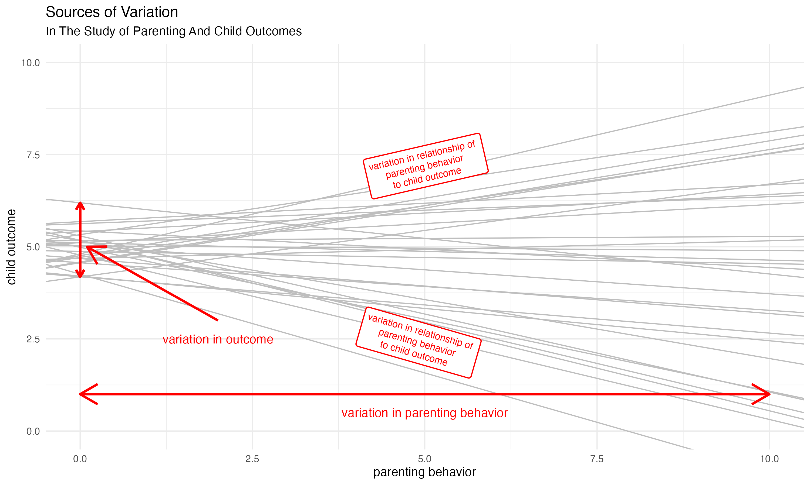
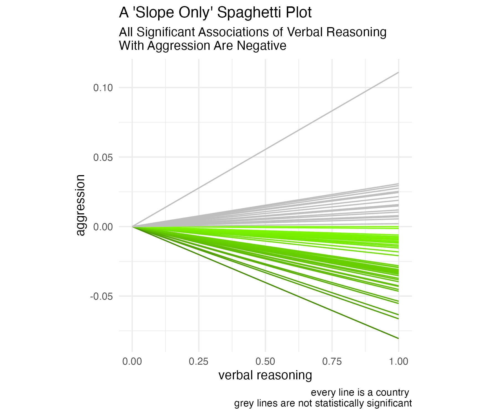

```{r}
#| output: false
#| echo: false

library(tibble) # data frames

library(ggplot2) # beautiful graphs

library(geomtextpath) # path geoms

library(readr) # read csv

library(plotly) # interactive graphs

library(dplyr) # data wrangling

library(tidyr) # tidy data

library(countrycode) # work with country names

library(sf) # simple features

library(rnaturalearth) # natural earth data

```

# The Scope of the Issue 

::: {.incremental}
* UNICEF considers children globally to be in crisis: political violence, climate change, and poverty affect many children [@UNICEF2024fastfacts; @UNICEF2024notnewnormal].
* In this time of crisis, parenting is one crucial area of focus.
* According to UNICEF data, $\frac{1}{3}$ of children are subject to physical punishment [@Ward2023]; $\frac{2}{3}$ to some form of violent punishment [@UNICEF2024fastfacts].
* In a review of 50 years of literature on physical punishment, @Gershoff2016 connect physical punishment to poor mental health outcomes, and other poor outcomes over the life course. @Ward2023 examines the relationship of multiple forms of parental discipline to child outcomes.
:::

# Are We Similar? Are We Different?

::: {layout-ncol=2}


:::

# Highlighting Commonalities May Promote Intergroup Attitudes And Solidarity

> "@Hanel2019 cite research suggesting that ['highlighting similarities between groups improves interpersonal and intergroup attitudes.']{color="#FF0000"} Others have argued that ['build[ing] bonds of commonality across our differences' might be an impetus for social transformation]{color="#FF0000"} [@Hunt-Hendrix2024]."

# The Argument 

* Families, parents and children experience an incredible [diversity]{color="#FF0000"} of circumstances.
* Parents engage in parenting behaviors with consequent [diversity]{color="#FF0000"}, though with some [surprising similarities]{color="#FF0000"}.
* The associations of parenting with child outcomes are [surprisingly consistent]{color="#FF0000"}.


# Data 

MICS data collected by UNICEF from Low and Middle Income Countries (LMIC) around the world. $N = 224,632 \text{ families}; N_{countries} = 60$

Contains questions about parental discipline (both positive and negative) and child aggression. 


# Sources of Variation In The Study of Parenting And Child Outcomes



# Parenting Behaviors Vary *Somewhat* Across Countries

*Verbal reasoning* and *shouting* are the most common parental discipline behaviors toward young children.

{width=40%}

# A Modified Spaghetti Plot



# To Summarize ...

* There is an incredible diversity across countries, especially LMIC's.
* However, the associations of different forms of parental discipline are surprisingly consistent.
    + Explaining to children the difference between right and wrong has consistently ["good"]{color="#FFFFFF" bg-color="#006400"} outcomes in terms of aggression.
    + Spanking has consistently ["bad"]{color="#FFFFFF" bg-color="#8B0000"} outcomes in terms of aggression.
    + Shouting has consistently ["bad"]{color="#FFFFFF" bg-color="#8B0000"} outcomes in terms of aggression.
    + Name calling has consistently ["bad"]{color="#FFFFFF" bg-color="#8B0000"} outcomes in terms of aggression. 
    
    
